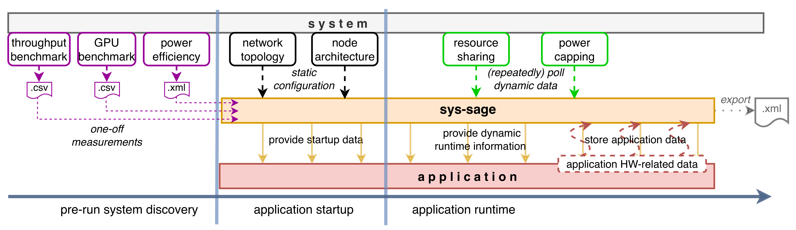
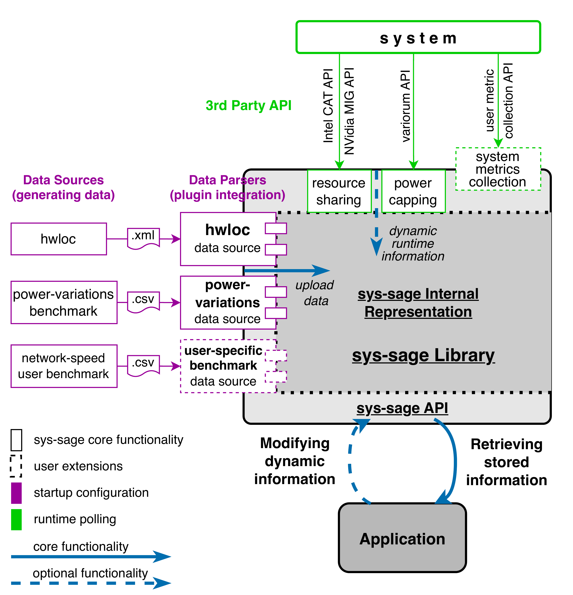

# Concept

## Workflow

The typical workflow is described in the figure below.

    

We use the term "user" to refer to any resource manager, daemon, user-side application, or any other entities that store or retrieve data from the library.

1. As part of the pre-run system discovery, the user measures and collects relevant topological information from available data sources
2. At application startup, the static configuration of the target architecture as well as the supplementary data from the previous step are imported into the library to materialize an initial system state.
3. During applicatin runtime, topological information can be queried/updated/extended through the library's unfied interface
4. Before the application terminates, the user may capture a snapshot of the system's state

## Conceptual Design

An overview of _sys-sage_'s design is given in the figure below.

    

**TODO**

The design of sys-sage reflects the requirements put on it. It is implemented in C++, where the particular constructs are implemented as C++ classes in the background.

There are three main parts of sys-sage:
- Data Sources
- Input Parsers
- Internal Representation

#### Data Sources
The Data Sources are programs capable of generating some information relevant to sys-sage.
The generated files (or other information sources) contain raw information to upload to the library.
There are two types of data sources:
1. Default Data Sources and
2. Custom Data Sources.

The Default Data Sources are Data Sources that come as a part of sys-sage (see the [Installation Guide](Installation_Guide.md) for options of building sys-sage with/without Default Data Sources).
The goal is to provide the frequently-used information to users out-of-the-box so that they do not need to implement anything.

The Custom Data Sources are data generated by the user’s own (custom) measurements, observations, or findings.
There is no limitation on what can and cannot be a Custom Data Source, the user is free to upload any (even remotely) HW-related information to sys-sage.
Custom Data Sources are not a part of the core of sys-sage but the users can easily make them a part of their workflow.

#### Input Parsers
Input Parsers are responsible for uploading the Data Sources into sys-sage.
They read the Data Sources and transfer them to structures recognized by the library’s internal representation.
Analogously to Data Sources, there are two types of Input Parsers:
1. Default Input Parsers and
2. Custom Input Parsers.

Default Parsers are a part of sys-sage and enable a simple out-of-the-box parsing and uploading of Default Data Sources.
Custom Parsers are user extensions to parse their Custom Data Sources.
Alternatively, a custom parser can be written by the user to parse a default Data Source in a custom way.
For instance, if the user is interested (for the sake of his use-case) in the hwloc output only on the NUMA-granularity, he can write a parser that would ignore the deeper layers provided by hwloc.

### Internal Representation
Internal Representation is the central part of the library that defines the components of the system as well as their logical relation, and the functionalities available through the API. It combines all data together in one logical representation and enables the connection between the different parts of the system as well as different types of information, while also targetting at easy orientation in the internal structure.

We represent an HPC system in sys-sage in the form of Components, their hierarchical physical structure (that we call Component Tree), and [Data Paths](class_data_path.html), which reflect additional relations and attributes between Components that go beyond the tree structure and can also reflect dynamic properties.
Data Paths form a Data-path Graph, which captures information that can be orthogonal to the information in the Component Tree, which mainly represents the static physical composition of the system.
Both the Component Tree and the Data-path Graph can be modified at runtime, allowing sys-sage to capture changing characteristics of a system.

Usually, a user would use Components to store some qualities of a part of a system (such as cache size, memory technology, CPU frequency, node id...).
Data Paths would be used to express a relation between two Components (such as bandwidth from a core to a cache/memory, or core-specific cache partitioning settings)

#### Components and Component Tree

The Component Tree is the mandatory part of the sys-sage design, which resembles the topology overview provided by hwloc.

An HPC system is composed of mul- tiple (physical or logical) elements that we call Components.
Components have hierarchical relations to each other, which we capture in the Component Tree.
It provides a structure that is easy to understand for the user and is easy to navigate in.
It represents the physical relation of the Components.

There are multiple **Component Types** that are derived from different (physical or logical) parts of the system so that their specific attributes can be represented.
There are the following Component Types available:
– **Component**: default generic type with no special attributes.
– **Topology**: the root of an HPC system.
– **Node**: HPC system nodes.
– **Chip**: a building block of a node. It may represent a CPU socket, a GPU, a NIC or any other chip.
– **Subdivision**: a generic grouping within the system.
– **NUMA**: NUMA regions are special and frequently-occurring case of subdivisions grouping memory locations.
– **Cache**: different levels of caches.
– **Core**: a physical processing core on a CPU or a block of compute units (GPU streaming multiprocessor).
– **Thread**: a hardware thread, i.e., what a Linux OS considers a ‘CPU’. Moreover, it is used to represent a compute unit on other chips (such as GPU threads).
– **Memory**: main/global memory or a part of it regardless of the technology.
– **Storage**: a data storage device.

Each Component shares a set of properties inherited from the generic *Component*.
On the top, there are additional specific properties depending on the *Component Type*.
Regardless of that, an arbitrary piece of information can be stored to each Component -- it is done by using its **attrib** map.
It is a std::map carrying a pointer; that means a user defines his key, attaches pointer to any structure, and can access the data later on.

Refer to the [API documentation on Components](class_component.html) for more information.

#### Data Paths and Data-path Graph
A Data Path is a construct that carries information about the relation of two arbitrary Components.
The set of Data Paths forms a Data-path Graph.
Each Data Path has a **source** and a **target Component**, but apart from that, no other rules apply.
Data Paths may be oriented (differentiating between the source and the target) or bidirectional.
There may also be multiple Data Paths connecting the same pair of Components, enabling the representation of multiple dependencies or relationships.
To differentiate between these, attribute ‘type’ is used to easily group or tell apart different kinds of information carried by Data Paths.

Analogously to Components, Data Paths have a set of default properties, such as bandwidth or latency, and an std::map **attrib**, where arbitrary information can be attached.
Data Paths may carry all different kinds of information, including but not limited to performance-related or power consumption-related information, or even application-specific data

The Data Paths are associated with Components they refer to – each Component contains pointers to all Data Paths associated with it; and each Data Path includes pointers to source and target Components.
In a usual use-case, one would use the Component Tree to locate Data Paths related to a part of the system.

Refer to the [API documentation on Data Paths](class_data_path.html) for more information.
