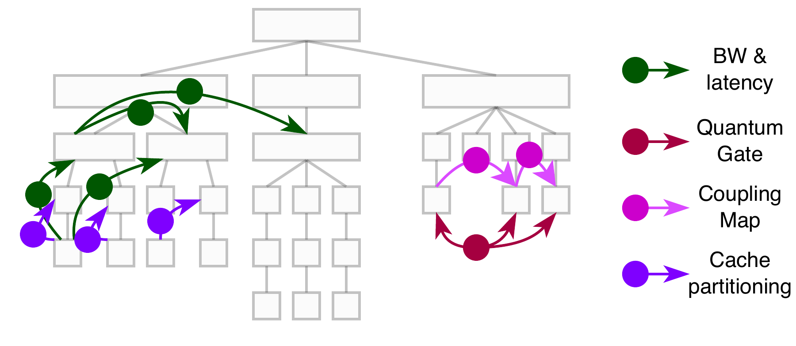

# Architectural Concept and Design

## Workflow

The typical workflow is described in the figure below.

    

We use the term "user" to refer to any resource manager, daemon, user-side application, or any other entities that store or retrieve data from the library.

1. As part of the pre-run system discovery, the user measures and collects relevant topological information from available data sources
2. At application startup, the static configuration of the target architecture as well as the supplementary data from the previous step are imported into the library to materialize an initial system state.
3. During applicatin runtime, topological information can be queried/updated/extended through the library's unfied interface
4. Before the application terminates, the user may capture a snapshot of the system's state

## Conceptual Design

An overview of _sys-sage_'s design is given in the figure below.

    

### Internal Representation

The hardware topology is modeled by an internal representation that aims at representing both the static, hierarchical and physical decomposition of hardware components as well as their dynamic, often non-hierarchical and logical interconnections.
It builds the foundation for the library by combining all data together into one central interface.

The physical hardware components are represented by the [Component](class_component.html) data structure, whose hierarchical layout form a **Component Tree** that naturaly describes the topologies basis.
Every piece of static or dynamic information attaches to or references Components within this tree, therefore being the primary access point to query topological information.
Although the design is inspired by [hwloc](https://www.open-mpi.org/projects/hwloc/)’s CPU-centric approach, _sys-sage_ significantly generalizes the concept to support a much broader and heterogeneous spectrum of hardware and system resources, thus extending far beyond CPU-centric modelling.
Users can interconnect Components arbitrarily, thus providing a high degree of freedom in expressing custom system configurations and layouts.
Furthermore, _sys-sage_ defines several ComponentTypes derived from distinct parts of computing hardware, with each being tailored towards holding the relevant characteristics and behaviors of its domain.
These types form a class inheritance hierarchy.
More information on the specific classes and their members can be found [here](class_component.html).

In contrast, a [Relation](class_relation.html) is a complementary data structure that reflect different relationships and interactions between Components.
The full collection of Relations forms a **Relations Graph**, which captures information orthogonal to the Component Tree.
Relations are typically referenced through the participating Components, and accommodate a broad spectrum of information types including data-transfer characteristics, performance indicators, power consumption, application-specific metrics, or quantum-specific properties.
Moreover, a Component can participate in an arbitrary number of Relations, and multiple Relations can connect the same subset of Components to represent different dependencies or properties.
This open design provides high flexibility for diverse user-defined use-case scenarios.
Similar to Components, each Relation belongs to a specific RelationType, which allows for more specialized functionality targeted at a specific usage scenario.
Additionally, the RelationCategory provides semantic tagging of the specific Relation.
More information can be found [here](class_relation.html).

To illustrate the distinction, Components may represent individual caches along with their size, associativity, or observed hit rates from hardware counters.
Components will also be used to store a CPU core’s register file size and current frequency.
Relations extend this view by capturing relational properties between an arbitrary number of (often two: source-target) Components — for instance, cache-to-core load latencies across multiple cache levels or the fraction of cross-NUMA memory accesses between different NUMA domains.
The figures below showcases this distinction.

    
    

The one one the left shows the Component Tree consisting of different ComponentTypes marked by different colors, whereas the figure on the right demonstrates relations carrying different information as indicated by the different colors.

### Data Sources and Input Parsers

### 3rd party extensions

### User-specific Attributes
