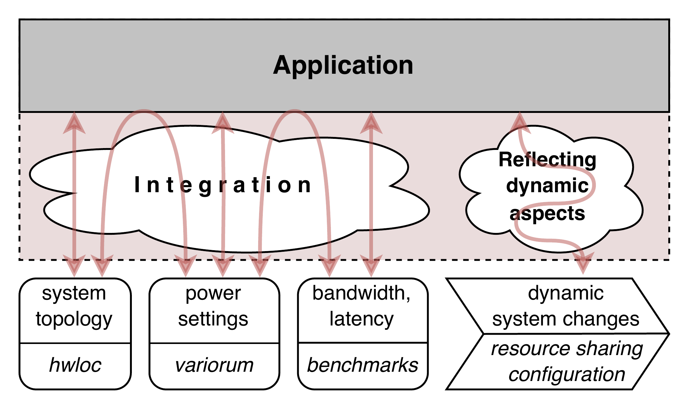
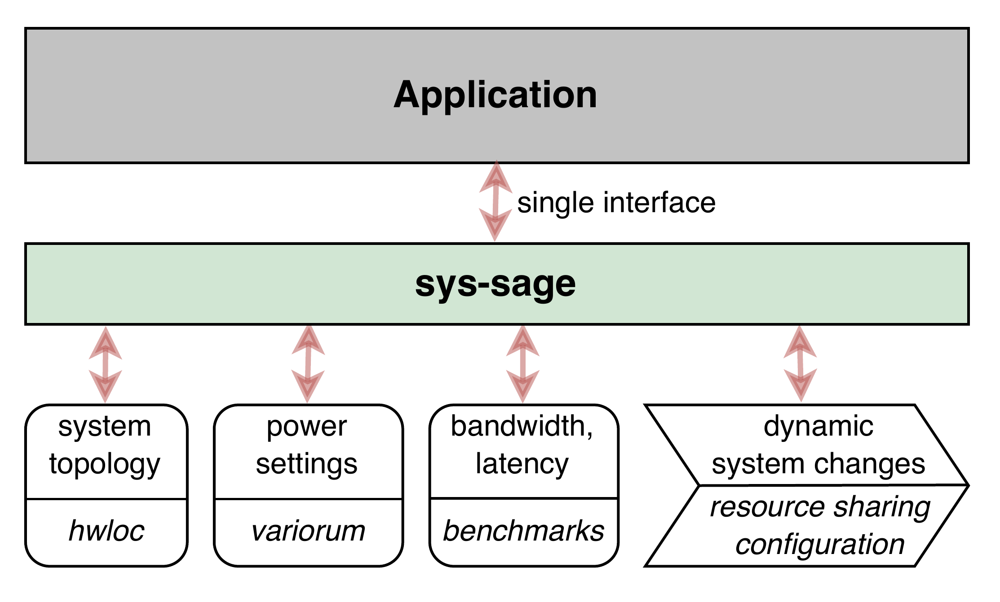

# sys-sage: A Library for Representing System Architectures and their Dynamic Properties

## Preface

_sys-sage_ is a modern, extensible C++20 library for **describing, analyzing, and manipulating** system architectures and their dynamic properties.
Whether you’re working with classic HPC clusters, heterogeneous nodes, or exploring new computing paradigms, _sys-sage_ gives you the ability to **introspect your hardware platform** to get a unified representation of hardware components and their interconnections, static or dynamic system state and configurations, momentual measurements, calibration data, application-specific hardware-relevant information, and all the metadata that matters.

### What is sys-sage?

At its core, _sys-sage_ is a toolkit for building, managing, and querying a **rich, extensible model of your system’s hardware topology**.
With hardware architectures evolving into intricate topologies composed of heterogeneous multi-core and GPU processing units, distinct memory technologies, custom node configurations, HPCQC integrations, and more, _sys-sage_ composes a centralized hub that incorporates diverse topological information from different data sources to provide crucial analytical context for hardware-conscious and performance-driven applications.
Rather than collecting the data itself, it aims at integrating and complementing data from existing sources to create an extensive model that would otherwise be incomplete when only using a single source.
It’s designed for:

- **Researchers** who want to experiment with new hardware or system layouts and who need to correlate diverse system information to get a more comprehensive understaiding of the system.
- **Tool developers** building schedulers, mappers, or simulators.
- **System architects** who need to capture and reason about complex, evolving topologies.

    
    

### Why care about hardware topology?

Knowledge about the composition and layout of your target architecture is vital for analyzing and reasoning about your platform's compute capabilities and your application's performance.
It is by considering the architecture's properties, be it static or dynamic, that the hardware can be leveraged to optimize your application.

Consider for instance the dynamic setting of the L3 partition size in which multiple applications have access to an isolated portion of the L3 cache that may be subject to change at runtime.
Cache-aware algorithms need to query this dynamic property from the topology to adjust cache-sensitive data structures and configurations, e.g. block size.

### Why use sys-sage?

- **Unified model:** Represent all your hardware and logical resources in one place.
- **Increased portability:** Automate topology discovery to avoid hard-coded assumptions about the system's architecture.
- **Extensible:** Add new 3rd-party data sources or APIs, or attach custom metadata, without changing the core.
- **Easy traversal and queries:** Find all GPUs, all interconnections, or all components with a certain property.
- **Serialization:** Import/export your system topology to JSON to capture and recreate the exact system representation, including all internal information, on a different machine or at a different time.
- **Python API:** Use sys-sage from Python for rapid prototyping, data science, or integration with other tools.

## Documentation overview
- [Installation Guide](Installation_Guide.md)
- [Architectural Concept and Design](Concept.md)
- [Library Features](Features.md)
- [Public API](API.md)

## Documentation Versioning

- [latest](https://stepanvanecek.github.io/sys-sage/latest/html/index.html)
- [1.0.0](https://stepanvanecek.github.io/sys-sage/1.0.0/html/index.html)
- [0.5.2](https://stepanvanecek.github.io/sys-sage/0.5.2/html/index.html)

## About

_sys-sage_ has been created by Stepan Vanecek (stepan.vanecek@tum.de) and the [CAPS TUM](https://www.ce.cit.tum.de/en/caps/homepage/).
Please contact us in case of questions, bug reporting etc.

The source code can be found at [https://github.com/caps-tum/sys-sage](https://github.com/caps-tum/sys-sage).

_sys-sage_ is available under the Apache-2.0 license. (see [License](https://github.com/caps-tum/sys-sage/blob/master/LICENSE))

Version: 1.0.0