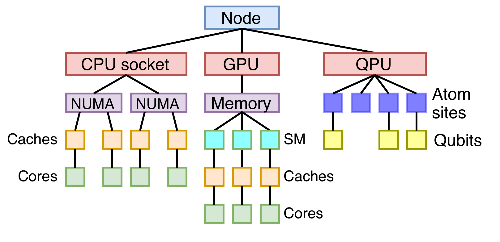

# Tutorial 01: Building Your Hardware Topology

In this tutorial, we will construct a Componet Tree step-by-step to model a (theoretical) target platform.
We will further express relational properties between the hardware components through the Relations Graph.

Let us consider the topology that was illustrated in the [documentation](../../docs/Concept.md) as shown in the figures below

<p align="middle">
    
</p>

## Component Tree

To use the _sys-sage_ library, we first have to include _sys-sage_'s primary header file:

```cpp
#include <sys-sage.hpp>
```

Afterwards, we can start by creating the node:

```cpp
sys_sage::Component *node = new sys_sage::Node(0, "Node0");
```

The arguments passed to the constructor denote the ID and the name of the node.
These are completely optional, but we advise to assign a unique ID if possible, in order to distinguish Components of the same type within the same domain (e.g. caches within a CPU and GPU typically have unique IDs, but an ID may be shared across CPUs and GPUs).
Unique IDs may be important when querying information from the topology.
Furthermore, we store the pointer of the node in a pointer of type \ref sys_sage::Component.
This class forms a base class of all Components and is idiomatically used to represent all Components within the Component Tree.

At the top-most level, the node contains one CPU socket, one GPU and one QPU:

```cpp
sys_sage::Component *cpu = new sys_sage::Chip(node, 0, "CPU0", sys_sage::ChipCategory::CpuSocket);
sys_sage::Component *gpu = new sys_sage::Chip(node, 1, "GPU0", sys_sage::ChipCategory::Gpu);
sys_sage::Component *qpu = new sys_sage::QuantumBackend(node, 0, "QPU0");
```

Since the first parameter of all the three constructors is the node that we previously initialized, we create a hierarchy in which the node is the parent and the CPU, GPU and QPU its chidlren.

Going one level deeper, the CPU socket includes two NUMA nodes, the GPU one main memory unit and the QPU four atom sites.
We note here that the model typically places memory, which is shared among different Components, further up the tree and compute units at the bottom.
This means that the further we go down the Component Tree, the more exlcusive the resources usually get:

```cpp
sys_sage::Component *numa0 = new sys_sage::Numa(cpu, 0);
sys_sage::Component *numa1 = new sys_sage::Numa(cpu, 1);

sys_sage::Component *vram = new sys_sage::Memory(gpu, 0);

sys_sage::Component *atomSite0 = new sys_sage::AtomSite(qpu, 0);
sys_sage::Component *atomSite1 = new sys_sage::AtomSite(qpu, 1);
sys_sage::Component *atomSite2 = new sys_sage::AtomSite(qpu, 2);
sys_sage::Component *atomSite3 = new sys_sage::AtomSite(qpu, 3);
```

We have omitted the name of the Components for brevity.
In a similar manner, we proceed with creating the remaining levels of the Component Tree:

```cpp
// CPU
sys_sage::Component *cpuCache0 = new sys_sage::Cache(numa0, 0);
sys_sage::Component *cpuCache1 = new sys_sage::Cache(numa0, 1);
sys_sage::Component *cpuCache2 = new sys_sage::Cache(numa1, 2);
sys_sage::Component *cpuCache3 = new sys_sage::Cache(numa1, 3);

sys_sage::Component *cpuCore0 = new sys_sage::Cache(cpuCache0, 0);
sys_sage::Component *cpuCore1 = new sys_sage::Cache(cpuCache1, 1);
sys_sage::Component *cpuCore2 = new sys_sage::Cache(cpuCache2, 2);
sys_sage::Component *cpuCore3 = new sys_sage::Cache(cpuCache3, 3);

// GPU
sys_sage::Component *gpuSM0 = new sys_sage::Subdivision(vram, 0);
sys_sage::Component *gpuSM1 = new sys_sage::Subdivision(vram, 1);
sys_sage::Component *gpuSM2 = new sys_sage::Subdivision(vram, 2);
gpuSM0->SetSubdivisionCategory(sys_sage::SubdivisionCategory::GpuSM);
gpuSM1->SetSubdivisionCategory(sys_sage::SubdivisionCategory::GpuSM);
gpuSM2->SetSubdivisionCategory(sys_sage::SubdivisionCategory::GpuSM);

sys_sage::Component *gpuCache0 = new sys_sage::Cache(gpuSM0, 0);
sys_sage::Component *gpuCache1 = new sys_sage::Cache(gpuSM1, 1);
sys_sage::Component *gpuCache2 = new sys_sage::Cache(gpuSM2, 2);

sys_sage::Component *gpuCore0 = new sys_sage::Cache(gpuCache0, 0);
sys_sage::Component *gpuCore1 = new sys_sage::Cache(gpuCache1, 1);
sys_sage::Component *gpuCore2 = new sys_sage::Cache(gpuCache2, 2);

// QPU
sys_sage::Component *qubit0 = new sys_sage::Qubit(atomSite0, 0);
sys_sage::Component *qubit1 = new sys_sage::Qubit(atomSite2, 1);
sys_sage::Component *qubit2 = new sys_sage::Qubit(atomSite3, 2);
```

In this example we have made use of the constructors to interlink the Components.
You may also use the more flexible methods \ref sys_sage::Component::InsertChild, \ref sys_sage::Component::InsertBetweenParentAndChild or \ref sys_sage::Component::InsertBetweenParentAndChildren.

More information about existing classes and supported hardware components can be found [here](class_component.html).
You are also free to go beyond the supported ComponentTypes by using the \ref sys_sage::Component base class and attaching user-specific attributes to it.

## Relations Graph

Now, let us define some Relations between the Components to convey some dynamic properties.

After collecting some benchmark results during the pre-run system discovery, we have measured the bandwidth and the latency from the CPU core 0 to NUMA nodes 0 and 1.
Moreover, we can apply a CNOT gate between qubit 1 and 2:

```cpp
/*
 * For the sake of simplicity, let's assume the measurement results are hardcoded.
 * In a more realistic scenario, you would either parse a file containing the measurement results or poll them directly from the benchmark library at runtime.
 */
double bandWidthCpuCore0ToNuma0 = 300e9;
double latencyCpuCore0ToNuma0 = 100e-9;
double bandWidthCpuCore0ToNuma1 = 150e9;
double latencyCpuCore0ToNuma1 = 200e-9;

sys_sage::Relation *dpCpuCore0ToNuma0 = new sys_sage::DataPath(cpuCore0, numa0, sys_sage::DataPathOrientation::Bidirectional, sys_sage::DataPathCategory::Datatransfer, bandWidthCpuCore0ToNuma0, latencyCpuCore0ToNuma0);
sys_sage::Relation *dpCpuCore0ToNuma1 = new sys_sage::DataPath(cpuCore0, numa1, sys_sage::DataPathOrientation::Bidirectional, sys_sage::DataPathCategory::Datatransfer, bandWidthCpuCore0ToNuma1, latencyCpuCore0ToNuma1);

sys_sage::Relation *qgate = new sys_sage::QuantumGate(2, "cx");
static_cast<sys_sage::QuantumGate *>(qgate)->SetQuantumGateCategory(); // make sure that category is set to CNOT
qgate->AddComponent(qubit1);
qgate->AddComponent(qubit2);
```

Since the relation between the core and the NUMA nodes contains information about data transfer, we have modeled this connection using the \ref sys_sage::DataPath class.
Due to the data flowing in both directions (e.g. load and store), we have decided to make the relations bidirectional.
Note that we didn't make a distinction between bandwidth/latency in the read and write direction for simplicity.
The distinction can be made by attaching attributes to the relation.
More on that in a later tutorial.
To model the quantum gate, _sys-sage_ already provides a dedicated \ref sys_sage::QuantumGate class.
Have a look [here](class_relation.html) to get an overview of already supported relation types.
As mentioned before, you can make use of the \ref sys_sage::Relation base class to extent the functionality for user-specific scenarios.

## Managing the Topology

Let us simply print out the Component Tree and the Relations Graph:

```cpp
node->PrintSubtree();
node->PrintRelationsInSubtree();
```

Since the root of the tree is the node, we call the methods with respect to the `node` object.
The second line also shows that Relations are usually referenced through the Component Tree.

Examples on how to traverse the topology and to query/insert/update information from the topology will be shown in the next tutorials.
For now, we need to focus on the lifetimes of the created Component and Relation objects.

### Ownership & Correct Clean-Up

Components do not take ownership of other Components and Relations.
Therefore, the destructor of the \ref sys_sage::Component class will only **unlink the Component from its parent, its children and all of its associated relations**, while additionally cleaning up any claimed resources.
This also means that the construction order of Components does not matter at all (e.g. a Component child can be instantiated before its parent).
If the Component should be cleaned up along with all of its associated Relations, the \ref Component::Delete function should be used.
This function assumes that the Component itself and all the Relations are **heap-allocated**!
Moreover, if it is desired to delete the entire subtree spanned by a Component, then the \ref Component::DeleteSubtree function should be used.
This will also delete all the Relations of the subcomponents.
Similarly, this function assumes that all objects are **allocated on the heap**!

Apart from this, Relations do not take ownership of Components.
Hence, the destructor of the \ref sys_sage::Relation class simply **unlinks itself from the Components** in addition to cleaning up claimed resources.
It has no influence on other Relations.
For consistency purposes, we also provide a \ref Relation::Delete function, which is a simple wrapper around a call to `operator delete` on the given relation.
Naturally, this assumes **heap allocation**.

### Stack-allocated vs. heap-allocated

You can to freely create Components and Relations on the stack or on the heap.
However, mixing stack-allocated and heap-allocated objects need to be done with care.
An overview of functions that assume heap-allocation is given below:

- \ref Component::Delete
- \ref Component::DeleteSubtree
- \ref Component::DeleteRelations
- \ref Relation::Delete

If for instance a child Component is a local stack variable while the parent is heap-allocated, then `Component::DeleteSubtree` should only be called when the child exits the scope in which it was instantiated.
The following examples highlight different scenarios of constructing and destroying Components.

```cpp
#include <sys-sage.hpp>

int main()
{
    {
        // first create the parent on the stack and then the child

        sys_sage::Component parent;
        sys_sage::Component child (&parent);
    }

    {
        // first create the child on the stack and then the parent

        sys_sage::Component child;
        sys_sage::Component parent;
        parent.InsertChild(&child);
    }

    {
        // create the parent and child on the heap

        auto parent = new sys_sage::Component;
        auto child = new sys_sage::Component(parent);

        // `delete` can be called in any order
        delete parent;
        delete child;
    }

    {
        // aggregate deletion of the Component Tree

        auto child = new sys_sage::Component;
        auto parent = new sys_sage::Component;
        parent->InsertChild(child);

        sys_sage::Component::DeleteSubtree(parent);

        // `parent` and `child` are deleted
    }

    {
        // create the parent on the heap and the child on the stack

        auto parent = new sys_sage::Component;
        sys_sage::Component child (parent);

        delete parent; // does not falsly clean up the child

        // child is cleaned up at scope exit
    }

    {
        // create the parent on the heap and the child on the stack in another scope

        auto parent = new sys_sage::Component;
        {
            sys_sage::Component child (parent);

            // child gets removed from the Component Tree and is cleaned-up at exit scope
        }

        sys_sage::Component::DeleteSubtree(parent); // no problems
    }

    {
        // create the parent on the stack and the child on the heap

        sys_sage::Component parent;
        auto child = new sys_sage::Component(&parent);

        sys_sage::Component::DeleteSubtree(&parent, true); // only deletes the child without falsly trying to deallocate the parent
    }

    return 0;
}
```

### Smart pointers

Since _sys-sage_ does not enforce ownership, using smart pointers may not yield the expected outcome.
Consider the following:

```cpp
#include <sys-sage.hpp>
#include <memory>

int main()
{
    auto node = std::make_unique<sys_sage::Node>();

    sys_sage::parseHwlocOutput(node.get(), "path/to/topo.xml");

    return 0;

    // does not correctly clean up the entire Component Tree at scope exit
}
```

Since the destructor of `comp` only unlinks itself from the subtree without deleting it, the above would technically leak memory.
For this purpose, a custom deleter can be built with `Component::DeleteSubtree`.
A possible implementation would be:

```cpp
#include <sys-sage.hpp>
#include <memory>

struct Deleter
{
    void operator()(sys_sage::Component *comp) const
    {
        sys_sage::Component::DeleteSubtree(comp);
    }
};

int main()
{
    std::unique_ptr<sys_sage::Node, Deleter> node (new sys_sage::Node);

    sys_sage::parseHwlocOutput(node.get(), "path/to/topo.xml");

    return 0;

    // correctly cleans up the entire Component Tree at scope exit
}
```

## Putting Everything Together

The complete code for this tutorial is given below:

```cpp
#include <sys-sage.hpp>

int main()
{
    sys_sage::Component *node = new sys_sage::Node(0, "Node0");

    sys_sage::Component *cpu = new sys_sage::Chip(node, 0, "CPU0", sys_sage::ChipCategory::CpuSocket);
    sys_sage::Component *gpu = new sys_sage::Chip(node, 1, "GPU0", sys_sage::ChipCategory::Gpu);
    sys_sage::Component *qpu = new sys_sage::QuantumBackend(node, 0, "QPU0");

    sys_sage::Component *numa0 = new sys_sage::Numa(cpu, 0);
    sys_sage::Component *numa1 = new sys_sage::Numa(cpu, 1);

    sys_sage::Component *vram = new sys_sage::Memory(gpu, 0);

    sys_sage::Component *atomSite0 = new sys_sage::AtomSite(qpu, 0);
    sys_sage::Component *atomSite1 = new sys_sage::AtomSite(qpu, 1);
    sys_sage::Component *atomSite2 = new sys_sage::AtomSite(qpu, 2);
    sys_sage::Component *atomSite3 = new sys_sage::AtomSite(qpu, 3);

    // CPU
    sys_sage::Component *cpuCache0 = new sys_sage::Cache(numa0, 0);
    sys_sage::Component *cpuCache1 = new sys_sage::Cache(numa0, 1);
    sys_sage::Component *cpuCache2 = new sys_sage::Cache(numa1, 2);
    sys_sage::Component *cpuCache3 = new sys_sage::Cache(numa1, 3);

    sys_sage::Component *cpuCore0 = new sys_sage::Cache(cpuCache0, 0);
    sys_sage::Component *cpuCore1 = new sys_sage::Cache(cpuCache1, 1);
    sys_sage::Component *cpuCore2 = new sys_sage::Cache(cpuCache2, 2);
    sys_sage::Component *cpuCore3 = new sys_sage::Cache(cpuCache3, 3);

    // GPU
    sys_sage::Component *gpuSM0 = new sys_sage::Subdivision(vram, 0);
    sys_sage::Component *gpuSM1 = new sys_sage::Subdivision(vram, 1);
    sys_sage::Component *gpuSM2 = new sys_sage::Subdivision(vram, 2);
    gpuSM0->SetSubdivisionCategory(sys_sage::SubdivisionCategory::GpuSM);
    gpuSM1->SetSubdivisionCategory(sys_sage::SubdivisionCategory::GpuSM);
    gpuSM2->SetSubdivisionCategory(sys_sage::SubdivisionCategory::GpuSM);

    sys_sage::Component *gpuCache0 = new sys_sage::Cache(gpuSM0, 0);
    sys_sage::Component *gpuCache1 = new sys_sage::Cache(gpuSM1, 1);
    sys_sage::Component *gpuCache2 = new sys_sage::Cache(gpuSM2, 2);

    sys_sage::Component *gpuCore0 = new sys_sage::Cache(gpuCache0, 0);
    sys_sage::Component *gpuCore1 = new sys_sage::Cache(gpuCache1, 1);
    sys_sage::Component *gpuCore2 = new sys_sage::Cache(gpuCache2, 2);

    // QPU
    sys_sage::Component *qubit0 = new sys_sage::Qubit(atomSite0, 0);
    sys_sage::Component *qubit1 = new sys_sage::Qubit(atomSite2, 1);
    sys_sage::Component *qubit2 = new sys_sage::Qubit(atomSite3, 2);

    double bandWidthCpuCore0ToNuma0 = 300e9;
    double latencyCpuCore0ToNuma0 = 100e-9;
    double bandWidthCpuCore0ToNuma1 = 150e9;
    double latencyCpuCore0ToNuma1 = 200e-9;

    sys_sage::Relation *dpCpuCore0ToNuma0 = new sys_sage::DataPath(cpuCore0, numa0, sys_sage::DataPathOrientation::Bidirectional, sys_sage::DataPathCategory::Datatransfer, bandWidthCpuCore0ToNuma0, latencyCpuCore0ToNuma0);
    sys_sage::Relation *dpCpuCore0ToNuma1 = new sys_sage::DataPath(cpuCore0, numa1, sys_sage::DataPathOrientation::Bidirectional, sys_sage::DataPathCategory::Datatransfer, bandWidthCpuCore0ToNuma1, latencyCpuCore0ToNuma1);

    sys_sage::Relation *qgate = new sys_sage::QuantumGate(2, "cx");
    static_cast<sys_sage::QuantumGate *>(qgate)->SetQuantumGateCategory(); // make sure that category is set to CNOT
    qgate->AddComponent(qubit1);
    qgate->AddComponent(qubit2);

    node->PrintSubtree();
    node->PrintRelationsInSubtree();

    sys_sage::Component::DeleteSubtree(node);

    return 0;
}
```
